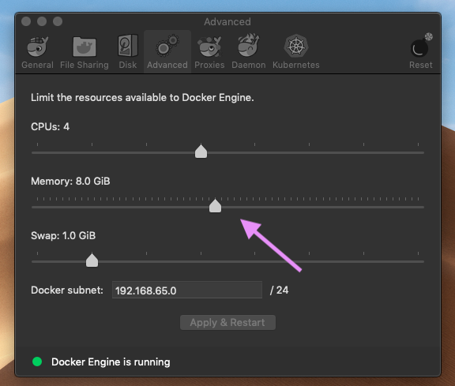

# Ikra　-RNAseq pipeline centered on Salmon- 

[idep](http://bioinformatics.sdstate.edu/idep/)のinputとして発現量テーブル（gene × sample）をexperiment matrixから自動でつくる。salmonを用いる。

## 注意

MAX_SPOT_IDが0以外の値のときはテストモード（fastq-dumpでダウンロードするread数)。デフォルトは現在全リード取得。時間がかかるので、テストの場合は各自`ikura.sh`の中を変更する。
optionが実装されたときにtest modeについてもオプション立てれるようにする予定。

## Usage

```
Usage: ikra.sh experiment_table.csv spiece [--test, --fastq, --help, --without-docker, --udocker] [--threads [VALUE]]
  args
    1.experiment matrix(csv)
    2.reference(human or mouse)

Options:
  --test  test mode(MAX_SPOT_ID=100000).(dafault : False)
  --fastq use fastq files instead of SRRid. The extension must be foo.fastq.gz (default : False)
  -u, --udocker
  -w, --without-docker
  -t, --threads
  -s1, --suffix_PE_1    suffix for PE fastq files.(default : _1.fastq.gz)
  -s2, --suffix_PE_2    suffix for PE fastq files.(default : _2.fastq.gz)
  -h, --help    Show usage.
```

1. test optionは各サンプルにおいてリード数を100000に限定する。
2. udocker modeはUser権限しか使えないサーバー環境用。詳しくは[https://github.com/indigo-dc/udocker](https://github.com/indigo-dc/udocker)。
3. without-docker modeはすべてのツールをインストールした状態で動く。非推奨。
4. threads

experiment matrixはカンマ区切りで（csv形式）

**SRR mode**

|  name  |  SRR |  Layout  | condition1 | ... |
| ---- | ---- | - | - | - |
|  Treg_LN_1  | SRR5385247 | SE | Treg | ...|
|  Treg_LN_2  |  SRR5385248  | SE  | Treg | ... |

**fastq mode**

|  name  |  fastq(PREFIX) |  Layout  | condition1 | ... |
| ---- | ---- | - | - | - |
|  Treg_LN_1  | hoge/SRR5385247 | SE | Treg | ...|
|  Treg_LN_2  |  hoge/SRR5385248  | SE  | Treg | ... |

- nameはアンダーバー区切りでcondition、replicateをつなげて書く。
- 前3列は必須。
- 自前のfastq fileを使いたいときは`--fastq`をつける。拡張子は`fastq.gz`のみに対応。
- fastq fileは`fastq.gz`もしくは`_1.fastq.gz`,`_2.fastq.gz`を除いたpathを。例えば`hoge/SRR5385247.fastq.gz`なら`hoge/SRR5385247`と記載。
- suffixが`_1.fastq.gz`,`_2.fastq.gz`ではない場合は-s1, -s2オプションをつける。

- Illumina用 : trimmomatic -> trim_galoreに切り替えた。
- Ion S5用: SEしか無い。trimmomaticではなくfastx-toolsを使う。adapterはNoneを入れておく。(test : [DRP003376](https://trace.ncbi.nlm.nih.gov/Traces/sra/?study=DRP003376))

### 仕様について

- outputは**scaledTPM** (see. [Soneson, C., Love, M. I. & Robinson, M. D. Differential analyses for RNA-seq: transcript-level estimates improve gene-level inferences. F1000Research 4, 1521 (2015).](https://f1000research.com/articles/4-1521/v2))。
- GCbiasについて、salmonで`--gcBias`を追加した。GCbiasのRNAseqにおける影響に関しては[Mike Love's blog :
RNA-seq fragment sequence bias](https://mikelove.wordpress.com/2016/09/26/rna-seq-fragment-sequence-bias/)。
- validateMappings optionを採用。（alignment-base modeでは使えない。）詳しくは[salmon Frequently Asked Questions](https://combine-lab.github.io/salmon/faq/)。

## Install

dockerかudocker(v1.1.3)をインストール済みであること。
もしくは、すべてのソフトを手動でインストールして、MakeCountTable*.shの`RUNINDOCKER=1`に設定する。
shell scriptなのでpathを通すだけ。以下は一例。

```bash
$ git clone https://github.com/yyoshiaki/auto_counttable_maker.git
$ cd auto_counttable_maker
$ echo "export PATH=$PATH:$PWD" >> ~/.bashrc
$ source ~/.bashrc
```

## test

### Illumina trim_galore ver.

#### SE

**SRR mode**

```bash
$ cd test/Illumina_SE && bash ../../ikura.sh Illumina_SE_SRR.csv mouse --test -t 10
```

**fastq mode**

SRR modeを実行したあとしかできない。（fastqはつけていないから。）

```bash
$ cd test/Illumina_SE && bash ../../ikura.sh Illumina_SE_fastq.csv mouse --fastq -t 10
```

#### PE

**SRR mode**

```bash
$ cd test/Illumina_PE && bash ../../ikura.sh Illumina_PE_SRR.csv mouse --test -t 50
```

**fastq mode**

SRR modeを実行したあとしかできない。（fastqはつけていないから。）

```bash
$ cd test/Illumina_PE && bash ../../ikura.sh Illumina_PE_fastq.csv mouse --fastq -t 10
```

### Ion (ThermoFisher)

```bash
$ cd test/Ion && bash ../../ikura_Ion_SRR.sh Ion_SRR.csv mouse
```

### Macのひと

salmonがmacで走らない問題だが、[DBCLS大田さん](https://github.com/inutano)に解決していただいた。macではdefaultで2Gbしかメモリをdockerに振っていないことが原因らしい。写真のように、8Gb等大きめのメモリ量を割り振って、Apply & Restartすると解決する。




## Tips

SRRデータを探している場合は[http://sra.dbcls.jp/](http://sra.dbcls.jp/index.html)が爆速でおすすめ。


## やること

[issue](https://github.com/yyoshiaki/auto_counttable_maker/issues)を参照のこと。

フォルダのパーミッションを777にしてrunした後755にしているが、果たして大丈夫？

## やったこと

- udockerの対応
- 生物種の判別(アナログ)
- gtf, transcript file をGENCODEから
- salmon
- trimmomatic(legacy)
- trim_galore!
- tximport
- fastxtools(Ion用)
- fastqかSRRの判別(マニュアル)
- salmon gcbias correctionの導入
- salomn validateMappings
- pigz(gzipのマルチスレッド版)
- fasterq-dump
- cwl開発少しだけ
- 名前の変更（ikura）

## legacy

trimmomaticを使ったトリミングを用いたフローは`./legacy`に移動しました。

## 開発戦略

今はまだ完成とは言えないので各自

**"development" branchの中** でFork -> Pull Request。直接masterは変えない。

## 参考

- [biocontainers : SNP-calling](http://biocontainers.pro/docs/containers-examples/SNP-Calling/)
- [idep](http://bioinformatics.sdstate.edu/idep/)
- [GENCODE](https://www.gencodegenes.org/)
- [salmon](https://combine-lab.github.io/salmon/getting_started/)

## cwl版の開発

2019/03/22 https://youtu.be/weJrq5QNt1M cwl作者のMichaelさんの来日配信に合わせてやってみた。
とりあえずPEでtrim_galoreとsalmonをcwl化した。

```
cd test/cwl_PE && bash test.sh
```


## cwl_toolsの由来、参考

- https://github.com/pitagora-galaxy/cwl
- https://github.com/roryk/salmon-cwl
